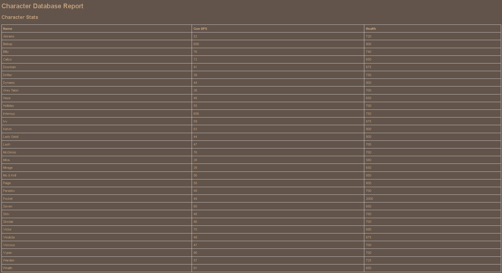
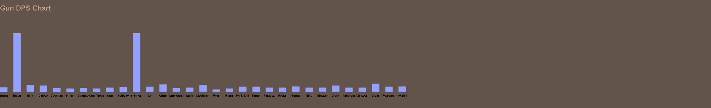
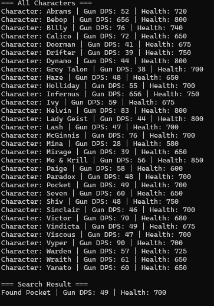
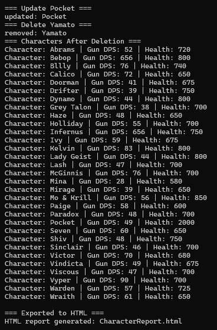

<h1 align="center">Austin Thompson Capstone Project</h1>

<h2 align="center">Capstone - Character Database</h2>

## [---Capstone Project---](Capstone/CharacterDatabase/CharacterDatabase)
## Example Outputs

 
## Enhancement Design and Goals

## Artifact - [Software Design and Engineering](Artifacts/crud.py)
  The enhancement is a C++ program that implements the CRUD functionality for database management and changed to handle character and their stats. Each character has their own stat sheets with different information for weapons and abilities. This project is based on the original crud artifact from CS 340 Python CRUD program that connected to a MongoDB database for an animal shelter. The enhancement to C++ was completed to demonstrate advanced software engineering, algorithms, and data structure skills. This enhancement was chosen for my ePortfolio because it clearly demonstrates my ability to design and implement a structured robust software solution.  

The project showcases multiple important skills and competencies in software development. First is the data structure implementation that has a database use a vector to store the Character objects. Each section also has error handling in the case of try catches and throwing exceptions to handle any issues and other errors gracefully. The software design principles used for the CharacterDatabase class encapsulates all operations to managing characters, maintaining clean separation of concerns and a cohesive design. This enhancement aligns successfully with the course outcomes, which include designing and evaluating computing solutions using appropriate data structures and algorithms, and demonstrating innovative techniques, skills, and tools in computing practices to implement solutions that deliver value. 

Reflecting on the process the enhancement from the original python artifact to C++ provided valuable learning opportunities. It helped deepen my understanding of memory management, type safety, and structured error handling in C++. Implementing the comprehensive Character struct with multiple stats challenged me to design readable output and efficient CRUD operations. One key challenge was ensuring robust error handling while maintaining the clarity and performance. Overall this process reinforced the importance of thoughtful software design, testing, and documentation in building maintainable and forward thinking systems. .

## Artifact - [Algorithms and Data Structures](Artifacts/CourseBST.cpp)
 For part 2 of the enhancement plan I added the Binary Sort Tree code from CS 300. The binary search tree was added to make efficient searching, insertion, updating, and deletion. This is added onto the existing infrastructure from the last enhancement of CRUD functionality. It also helps to demonstrate advanced data structure manipulation and algorithmic implementation in C++. The justification for why this was added as a part of the capstone project was to demonstrate my ability to design and implement complex data structures and algorithms in a structured, object-oriented way. Improvements from the original version include, replacing the simple crud storage model with a BST structure to efficiently organize and retrieve data, implementing a more robust exception handling, and organizing the program into modular files to better fit professional coding practices. These updates strengthened both the functionality and readability of the project, aligning it more closely with a more finished product. 

I believe this meets the course outcomes for this enhancement based on first demonstrating the ability to implement the BST algorithm into my existing code base. Next, I applied modularization, encapsulation, and error handling to reflect good software design principles. Finally I analyzed the limitations of the original crud only code and enhanced it with algorithmic efficiency and data abstraction. During the process of creating this part of the enhancement, having to break down the parts for handling the crud operations while maintaining the node handling in the BST. One challenge I faced was the delete operation, which had some errors with handling node deletion cases based on children. Overall this enhancement was a good test of my abilities to add on to an existing code base and connect algorithmic design with practical data management. 

## Artifact - [Databases](Artifacts/ProjectTwoDashboard-final.ipynb)
 The third artifact of the enhancement plan is based around databases. I chose to use my artifact from CS 340 which used MongoDB as a database for the animals in the animal shelter. For my enhancement I uses SQLite 3 and had it store our character info inside of it. In this enhancement moving from a csv file, I was allowed persistent data storage, so the character data could be loaded, queried, and managed across sessions. The program automatically reads from characters.db and populates our BST, we are then able to interact with it with our previous CRUD interface to adjust it. Finally at the end I added a way to create a html report with all the information after the change, and create a chart based on the gun damage on the bottom. 

I selected the enhancement this way to demonstrate the ability to bridge algorithmic data structurees with real world data management systems. This database integration required  me to understand the SQL schema and C++ database connectivity using SQLite3 to integrate a new data source different from the previous version. Some key components that highlight those skills are, the loadFromDB() function which uses prepared sql statements to query our data safely and efficiently with support from runtime exception handling. It also showcases the ability to integrate it into the system by taking the sql database and have it feed into our BST so I can integrate structured database output with a recursive in-memory data structure. This allowed me to convert this system from a local, static system to a scalable, persistent storage system. The enhancement meets the following course outcomes, first Data Management and Persistence via the SQLite integration for our storage, retrieval, and manipulation of persistent data. Next it handles Software development practices and error handling, with the modular integration of our database code being separated and then added in can allow for adjustments in the future, and the error handling and detection to ensure data import and handling is done safely. 

Reflecting on this enhancement, took some work getting the SQLite to work correctly and create the correct tables since the reading from the database is very strict with spelling and spaces. This helped me learn a new database structure compared to mongoDB to be able to compare and contrast their similarities in how you access them. During this time I also had to handle duplicates between the database and the BST and having to create a new function to handle duplicates. Overall this enhancment was a fun challenge to solidify my understanding of a more complex and real world system, connecting a backend to a front end and creating functions that can interact and share data between those systems.

## Self Assessment
 Throughout the design of this project, I have developed a deep and practical understanding of programming, software engineering, data structure, and database management. This capstone project was a way to combine those parts and create a whole as a demonstration of my abilities. The program was a way to learn and break down problem solving, design, and implementation of systems on a wide variety of formats making use of overall skill sets while also being hands on with the code itself. One large area of focus is data structures and algorithms, through projects being able to create and implement different sort algorithms, databases, and other functions being able to learn how they work and implementing them directly into projects. Through other classes with memory management, security reviews, reverse engineering, being able to break down points of weaknesses or see where previous APIs might have holes and then taking that and learning to help mend those to learn to deal with security issues and how they can affect projects as a whole and that its necessary to review it over and over to keep security up to date.
 For each artifact in the ePortfolio it is a different area of growth throughout this program. First with software engineering and converting python to C++ being able to read code break it down and then recreate it in another language shows the understanding of how the project functions and what is needed to occur for it to work in another language. Next with Algorithms and data structures, since I was working in C++ memory management and exception handling is greatly important and was taken care of along the way, with the Binary Search Tree it is used to showcase the understanding of future size handling for larger projects and having a modular design allowing the project to adapt from things like data input being a csv or a database. The third artifact of a database is the closest to understanding how data persists in the real world and not just in projects. Being able to create a database from scratch in a different system from before, and being able to have the existing program accept that code into it, which allowed me to demonstrate flexibility in coding practices but also future expandibility with larger real life datasets. In conclusion this Capstone Project and ePortfolio reflect my evolution throughout the program going from being able to create projects that can do simple equations to now handling data with databases and efficient sorting alogrithms with exception handling to help reduce errors.
